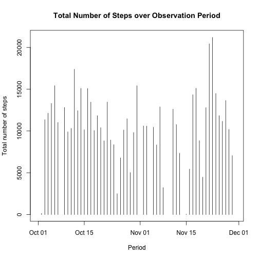
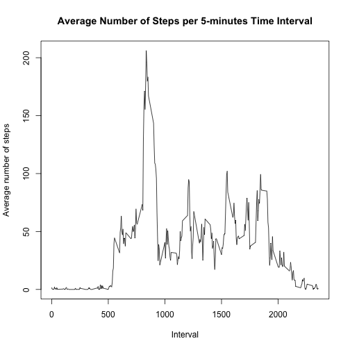
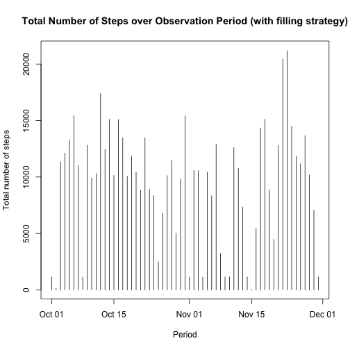
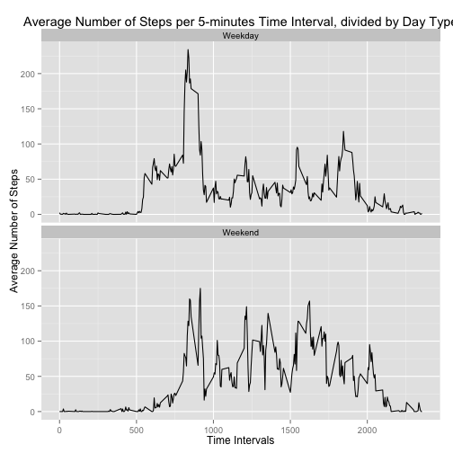

## Puropose

The following codes are used to perform data manipulations and ensuing analysis in order to answer the following questions.  

1. What is the mean total number of steps taken per day?
2. What is the average daily activity pattern?
3. Inputing the missing value  
a. Report total number of NAs  
b. Devise a strategy for filling in all of the missing values in the    dataset. The strategy does not need to be sophisticated. For example, you could use the mean/median for that day, or the mean for that 5-minute interval, etc.
4. Are there differences in activity patterns between weekdays and weekends?  

The following is a step by step processing codes, as well as their results when applied to the activity data.


## Loading necessary packages

The computation relies on two R packages, plyr and ggplot2, which needs to be loaded.


```r
library(plyr)
library(ggplot2)
```


## Loading and preprocessing the data

This section goes to a local folder and loads up the data into RStudio in order to be analysed later on. It verifies if the zip file is present in the local folder, and downloads it otherwise.  

The date comlumn is also converted to dates in this section, as it will be used to extract weekdays.


```r
# Local folder. To be modified to suit ones needs
setwd("~/GitHub/RepData_PeerAssessment1")

# The zip file checker. Verifies if file exists in the local folder and downloads it otherwise.
if (file.exists("activity.zip")==FALSE){
        download.file("https://d396qusza40orc.cloudfront.net/repdata%2Fdata%2Factivity.zip", destfile="activity.zip", method="curl")
        }

# Yeah, so unzip unzips the file.
unzip("activity.zip")

# Lock and load! The data is now in R
data <- read.csv("activity.csv")

# As mentionned, converting dates to the date format
data$date <- as.Date(data$date)

# Just showing off everything is ok
ls()
```

```
##  [1] "cleaningUp"       "data"             "Data"            
##  [4] "DayType"          "doc"              "fileurl"         
##  [7] "filled"           "inter"            "IntervalDay"     
## [10] "list.of.packages" "melted"           "meltedEcon"      
## [13] "new.packages"     "summary"          "summaryEcon"     
## [16] "top10Econ"        "top10Human"       "total"
```

```r
summary(data)
```

```
##      steps             date               interval     
##  Min.   :  0.00   Min.   :2012-10-01   Min.   :   0.0  
##  1st Qu.:  0.00   1st Qu.:2012-10-16   1st Qu.: 588.8  
##  Median :  0.00   Median :2012-10-31   Median :1177.5  
##  Mean   : 37.38   Mean   :2012-10-31   Mean   :1177.5  
##  3rd Qu.: 12.00   3rd Qu.:2012-11-15   3rd Qu.:1766.2  
##  Max.   :806.00   Max.   :2012-11-30   Max.   :2355.0  
##  NA's   :2304
```


## What is mean total number of steps taken per day?


```r
#Using ddply function from plyr package, summarizing the total number of steps, by day.
total <- ddply(data,"date",summarize, sum = sum(steps))

# Returning the average
print(paste("Mean:",mean(total$sum,na.rm=TRUE)))
```

```
## [1] "Mean: 10766.1886792453"
```

```r
# Returning the median
print(paste("Median:",median(total$sum,na.rm=TRUE)))
```

```
## [1] "Median: 10765"
```

```r
# Building histogram from the summarized data
plot(total$date,total$sum, type="h",xlab="Period", ylab="Total number of steps", main = "Total Number of Steps over Observation Period")
```

 
  
As the graphic shows, mid-October and late November were the most active days in this observation period.  


## What is the average daily activity pattern?


```r
# Summarizingn the data to obtain the average number of steps per 5-minutes interval.
inter <- ddply(data,"interval",summarize, AverageSteps = mean(steps,na.rm=TRUE))

#Make a time series plot (i.e. type = "l") of the 5-minute interval (x-axis) and the average number of steps taken, averaged across all days (y-axis)
plot(inter$interval,inter$AverageSteps, type="l",xlab="Interval", ylab="Average number of steps", main = "Average Number of Steps per 5-minutes Time Interval")
```

 

As the graph shows, the largest average number of steps happen in the lower intervals, or earlier in the day, with three distinct peaks later in the day.


```r
# Which 5-minute interval, on average across all the days in the dataset, contains the maximum number of steps?

## extracting the first column value corresponding to the maximum value of AverageSteps, coming from the inter object. The inter object summarized the average value of steps per 5-minutes interval.
print(paste("5-minutes interval with the largest average number of steps:",inter[inter[,2] == max(inter$AverageSteps),1]))
```

```
## [1] "5-minutes interval with the largest average number of steps: 835"
```

## Imputing missing values


```r
# 1. Report total number of NAs 
print(paste("Total number of NAs:",sum(is.na(data))))
```

```
## [1] "Total number of NAs: 2304"
```

```r
# 2. Devise a strategy for filling in all of the missing values in the dataset. The strategy does not need to be sophisticated. For example, you could use the mean/median for that day, or the mean for that 5-minute interval, etc.

## The strategy adopted was to replace the missing values by the median for their respective time interval. The strategy applied by the ddply function is to check if a row in column steps is NA (using is.na), if true, it returns the median of the column steps, else it returns the actual value in steps.

filled <- ddply(data, .(interval), transform, steps=ifelse(is.na(steps), median(steps, na.rm=TRUE), steps))

## The resulting dataset (filled) is then analyzed in the same way as previously to show the result of the strategy.
cleaningUp <- ddply(filled,"date",summarize, sum = sum(steps))

#average
print(paste("Mean:",mean(cleaningUp$sum,na.rm=TRUE)))
```

```
## [1] "Mean: 9503.86885245902"
```

```r
#median
print(paste("Median:",median(cleaningUp$sum,na.rm=TRUE)))
```

```
## [1] "Median: 10395"
```

```r
plot(cleaningUp$date,cleaningUp$sum, type="h", xlab="Period", ylab="Total number of steps", main = "Total Number of Steps over Observation Period (with filling strategy)")
```

 

As it can be observed, the graph shows fewer blank dates, but is nevertheless similar to the original. The mean and median for both dataset do differ though, and both are lower than their earlier counterpart.


## Are there differences in activity patterns between weekdays and weekends?


```r
# A new object is created (DayType) in order to keep the original data object intact.
DayType <- data

# Extracting the weekdays from the date column and storing the in a new column labelled days
DayType$days <- weekdays(as.Date(DayType$date))

# Labelling the weekdays (Yeah... I could've done better)
DayType$daytype[DayType$days == "Monday" | DayType$days == "Tuesday" | DayType$days == "Wednesday" | DayType$days == "Thursday" | DayType$days == "Friday"] <- "Weekday"

# Labelling the weekend (Yeah... I STILL could've done better)
DayType$daytype[DayType$days == "Saturday" | DayType$days == "Sunday"] <- "Weekend"

# Summarizing the data by daytype (weekday or weekend), and then by 5-minutes time intervals.
IntervalDay <- ddply(DayType,.(daytype,interval),summarize, MeanSteps = mean(steps,na.rm=TRUE))

# Plotting it all out as a panel plot.
qplot(interval,MeanSteps, data = IntervalDay, geom="line",ylab="Average Number of Steps",xlab = "Time Intervals", main="Average Number of Steps per 5-minutes Time Interval, divided by Day Type") + facet_wrap(~daytype,nrow=2)
```

 

The top panel shows the average number of steps by 5-minutes intervals observed during weekdays, while the bottom one displays the same measures but for weekends.  

As can be observed, more steps are recorded, on average, early during weekdays than on weekend. On the other hand, much more variability is observed at later times during the weekend, particularly after the morning peak. 
